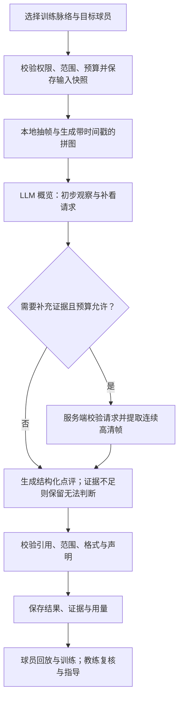

# SpinRead LLM strategy

状态：单脉络分析、结构化练习建议和可选历史同类训练对比已实现；整场汇总、单回合深入分析与成长路径页面仍为规划。运行说明见 [chapter-analysis.md](chapter-analysis.md)。
日期：2026-09-28
首个交付范围：用户选取的单个训练脉络分析。
本文区分已讨论确定的方向、建议的实现方式和待实测参数；采样参数与评价能力不是已经验证的结论。

## 1. 产品定位与目标

SpinRead 构建球员、AI 和真人教练共同参与的训练闭环。球员提供训练目标、主观感受和必要的标注；AI 整理视频证据、发现值得关注的动作并准备对比；真人教练结合现场背景修正判断、制定训练重点和复测标准。

LLM 的产品形态是嵌入训练流程的分析功能：选中训练内容、发起分析、查看证据、采取行动、复测。默认界面以分析卡片和视频跳转为中心。用户不需要通过开放式聊天反复解释正在分析哪段视频。

长期目标：

- 分析整场训练或整个视频，解释训练内容、表现和下一步重点。
- 先分析训练脉络的大块，再由用户选择具体回合深入分析。
- 在证据充分且评价规则经过验证后，对适合的表现维度打分。
- 对比多次训练中同一个动作，展示哪里进步、哪里仍反复出现问题。
- 让教练利用 AI 准备的证据和历史对比提供更有效的指导。

保留未来作为 MCP 向外部 LLM 提供结构化训练数据的方向。第一阶段只实现产品内的单脉络分析，接口与数据契约为后续复用留出边界。

## 2. 分析种类

| 类型 | 用户问题与入口 | 分析材料 | 输出 | 交付顺序 |
| --- | --- | --- | --- | --- |
| 单个训练脉络 `CHAPTER` | 选中“反手定点”“两点多球”“发接发”等色块，问这段练得怎么样 | 本段标签、目标、跨本段选取的连续动作样本，以及按需补看的画面 | 本段概览、做得好的地方、优先改进点、对应证据与练习建议 | 第一阶段 |
| 具体回合／选定小区间 `RALLY` | 从脉络点评进入某个回合，进一步看移动、还原或动作衔接 | 该回合及明确授权的上下文、更密集的连续帧；可关联父脉络分析 | 动作过程、具体问题、回放证据和针对性建议 | 第二阶段 |
| 整场训练／整个视频 `SESSION` | 训练结束后查看总体总结和表现评价 | 各脉络的结构化分析、采样覆盖情况、训练目标、可用的可靠统计 | 训练构成、主要表现、优先训练任务；按规则生成可评分维度 | 后续阶段 |
| 同动作前后对比 `COMPARISON` | 对比这次和上次的同类动作 | 通过可比性检查的前后片段、统一规则和原始视觉证据 | 改善／持平／退步／无法比较，配对证据及复测建议 | 后续阶段 |
| 多次训练成长路径 `PROGRESS` | 查看某项能力长期如何变化 | 多次可比分析、已确认的对比、教练反馈、执行和复测记录 | 按动作组织的成长记录、阶段里程碑、持续问题及下一步目标 | 最后汇总形成 |

“整场训练已分析”必须说明覆盖了哪些训练脉络。只分析一个色块时，页面只能称为“本段分析”。混合动作、不同难度的训练不直接合成为一个能力总分。

训练内容需要支持：正反手攻球、正反手拉上旋／下旋、搓球、定点、移动、多球、发接发，以及有顺序的组合练习。例如“反手拉上旋 → 跑位正手拉上旋”是一个动作序列，不能拆成几个互不相关的静态姿势来评判。

## 3. 第一阶段的用户体验

1. 用户在视频下方选择一个训练脉络，点击“分析本段”。人工标注区间和自动组织的区间均可使用。
2. 展示本次分析的名称、开始／结束时间和训练类型。要求明确目标球员；已有近端／远端标注可以预填，由用户确认。可补充一句关注点，例如“反手转正手时，移动是否及时”。
3. 用户选择已支持的模型并提供 API key，看到数据发送范围和本次预算。第一阶段建议 key 只用于本次任务，不写入浏览器持久存储、日志或分析结果。
4. 点击“开始分析”后创建后台任务，页面显示“准备画面 → 观察训练 → 补充查看（如需要）→ 整理点评”。用户可以继续播放视频，刷新后可以找回任务状态。
5. 结果展示简短概览、最多三个优先改进点、可用的正向观察和具体练习建议。每条观察均能点击回到证据区间。
6. 用户可以重新查看历史结果，或显式发起一次新的分析。修改脉络标注后，旧结果保留原输入快照，并提示它基于旧版本。

费用、模型、采样范围等放在分析设置或详情中。切分质量、置信度覆盖、检测器告警属于系统诊断，不作为用户默认训练建议。对影响点评的限制采用具体表达，例如“这一段手部被遮挡，无法评价触球动作”。

教练复核是整体设计的一部分；第一阶段先保留来源和审核状态，完整复核交互可在接入现有教练评审流程时交付。

## 4. 实际发送给 LLM 的数据

采用 GPT 图片输入路线时，服务端先解码视频并抽取画面。请求包含图片序列或拼图，以及单独提供的结构化上下文。第一阶段不发送完整视频文件，也不发送音轨。

| 数据 | 内容与来源 | 使用原则 |
| --- | --- | --- |
| 分析范围 | 视频标识、脉络标识、起止毫秒、相关版本 | 服务端校验；抽帧和补看均限制在已授权范围 |
| 目标球员 | 用户确认的近端／远端等选择、必要的参考图 | 近端／远端是本次镜头中的位置，不是跨训练的人物身份 |
| 训练意图 | 人工类型、动作标签、有序组合、用户关注点 | 作为训练背景，不作为“已正确完成动作”的证明 |
| 概览画面 | 带编号与时间戳的连续采样拼图 | 用于观察动作顺序和定位值得补看的片段 |
| 补充画面 | 指定短区间的独立较高清连续帧；必要时增加裁剪 | 保留全景参照，不通过裁剪丢失来球和球台关系 |
| 本地分析线索 | 在质量可用时提供球轨迹、可见性、候选事件时间等 | 注明来源和不确定性；第一阶段不依赖它们才能运行 |
| 评价规则 | 允许的观察维度、证据要求、无法判断规则、输出 schema | 与模型和提示词一起版本化 |

现有 BlurBall 与切分输出可能受到背景球台、桌面弹球和目标丢失影响。候选击球、自动类型和次数不能作为真值输入。人体关键点、拍面角度等只有在对应模块实际存在且通过验证后才能加入，不能用占位数据冒充已有检测能力。

所有用户填写的名称、备注和历史文本均作为数据传递，不能覆盖系统分析规则或改变工具权限。

### 输入结构示意

以下为已实现的输入契约示例（`spinread/product/chapter_contract.py`）；字段值和标识均为示例，不代表对现有视频的实际判断。实际 `training_intent` 还包含 `movement`；无法确定训练意图时 `source=UNKNOWN`。

```json
{
  "schema_version": "chapter-analysis-v1",
  "scope": {
    "video_id": "vid_example",
    "chapter_id": "chapter_example",
    "start_ms": 120000,
    "end_ms": 300000,
    "timeline_version": 3,
    "annotation_version": 2
  },
  "target": {"position": "FAR", "source": "USER"},
  "training_intent": {
    "feeding": "MULTIBALL",
    "action_sequence": ["反手拉上旋", "跑位正手拉上旋"],
    "source": "USER"
  },
  "focus": "动作衔接与还原",
  "sample_manifest_id": "samples_example",
  "known_limitations": ["旋转标签来自人工训练标注，未由画面独立验证"]
}
```

图片通过模型支持的图像输入字段传递。每个图片或拼图对应一个 manifest，记录帧 ID、源视频时间、拼图位置、裁剪区域和缩放参数；不把图片文件名当作唯一时间来源。

## 5. 处理流程：概览、补看、点评



### 5.1 建立稳定的输入快照

当前训练脉络部分由前端根据时间线组织，不应把短暂的 UI ID 当作唯一持久依据。分析请求需记录视频、区间、时间线版本、人工标注版本、目标球员、训练上下文及媒体版本。服务端校验这些输入与用户当前选择一致，发生冲突时要求刷新。

分析开始后使用该快照。后续合并、删除、重新标注或重新分析不会悄悄改变已有报告的含义，也不会将旧点评自动挂到新脉络上。

### 5.2 准备概览样本

- 从训练段的前、中、后部分选取若干连续短窗口，避免只选最好或最明显的回合。
- 现有回合边界可以辅助选样，但同时保留按视频时间分布的取样，避免漏标片段永远不被看见。
- 片段较短时覆盖整个区间；较长时记录采样覆盖，不声称逐帧看完。
- 保留准备、击球、移动和还原的上下文。边界超出选定区间时，第一阶段先截在授权范围内，并声明上下文不足。
- 不把跨数分钟的几张静态图当作连续动作序列；不同采样窗口明确分组。
- 镜头变化前后分别建立场景参照，目标球员无法保持明确时要求重新选择或停止相关判断。

### 5.3 第一轮：拼图概览

输入训练上下文和拼图，输出初步观察、无法判断项及补看请求。补看请求必须指出短时间范围和目的，例如“查看反手结束后至正手准备之间的移动”。

第一轮观察是内部草稿，不能直接被当作已确认的训练结论。模型没有证据时可以明确返回“不足以判断”，不强制凑够问题或建议。

### 5.4 第二轮：受控补看与最终点评

模型只提出请求，服务端负责执行。工具检查区间、帧数、裁剪坐标、访问权限和剩余预算。越界、重复或超限请求被拒绝或返回已有材料，不允许模型自行访问任意路径、网络 URL 或其他视频。

第一阶段建议最多一次补看轮次，一轮最多两个短窗口。第二次模型调用接收原上下文、概览材料以及实际提供的补充帧，生成最终结果。无补看需求时仍经过最终输出与校验步骤。

预算不足或补充提取失败时，模型只能依据已提供证据降低结论范围；不允许将失败的补看描述为“已查看”。

### 5.5 校验与呈现

结构校验后，再验证每个引用的帧确实已发送给本次模型、时间位于授权区间且属于正确视频，拒绝不存在的证据引用。建议与观察、可能原因分开储存。

这些检查只能证明引用有效，不能证明技术判断正确。判断质量仍需视觉评测、用户验收和教练复核。仅靠关键词黑名单或 JSON schema 无法消除幻觉。

## 6. 拼图与采样策略

拼图适合做概览。它可能减少视觉 token，但取决于模型的图像缩放、细节设置和图像块计费方式，不保证按图片张数同比节省。压缩 JPEG 字节大小也不等同于减少视觉 token。

用户提供的示例为 2560×2160 的 4×6 拼图，包含 23 帧和一个空格。每格约 640×360；整张图进入模型后若再次缩放，球、球拍与手部细节会更少。拼图必须保留编号、时间戳和明确的阅读顺序。

以下为第一阶段的实验起点，须通过真实片段评测后固定版本：

| 参数 | 建议起点 | 验证重点 |
| --- | --- | --- |
| 概览窗口 | 最多三个、每个约 4–6 秒 | 覆盖训练前中后，是否遗漏完整动作周期 |
| 概览采样 | 4 fps；每张拼图 8–12 帧 | 是否足以观察大致动作序列与定位补看位置 |
| 补看窗口 | 最多两个、每个最多 2 秒 | 是否能补足具体判断需要的前后变化 |
| 补看采样 | 8 fps 的独立图片，必要的目标人物裁剪 | 对比 4／8／16 fps 的质量与成本；不得超过源视频有效帧率 |
| 模型调用 | 正常路径两次：概览规划、最终点评 | 固定次数与按需补图带来的收益 |

按上述上限，概览最多 72 个采样帧，补看最多 32 个独立帧；这是数据量上限示例，不是承诺的 token 或美元价格。裁剪额外图片也必须计入上限。帧时间应来自实际解码时间戳，并映射回源视频，避免可变帧率或转码导致证据跳转错位。

不建议用稀疏采样评价触球瞬间的拍面角度、摩擦、真实旋转或精确球速。增加采样密度也无法恢复原视频未拍到、模糊或遮挡的信息。

## 7. 观察、评分与建议的边界

### 7.1 首先验证的观察维度

- 准备姿势与大致站位变化。
- 步法、移动方向以及动作衔接顺序。
- 击球后的还原与下一次准备。
- 在多个已观察动作周期中重复出现的表现。
- 与人工训练目标是否一致，例如组合练习是否出现预期动作顺序。

以上是候选能力，不代表模型已达到可用准确率。看不清或缺少上下文时返回 `NOT_ASSESSABLE`。只观察三个样本就只能描述这些样本，不能推断整段训练的精确发生率。

### 7.2 评分策略

评分是产品目标，第一阶段先交付可回放验证的观察与建议；数值评分作为经过校准后开启的能力。

建议使用固定维度、带文字锚点的 1–5 级规则，按动作类型制定，而不是直接生成一个 0–100 的总体能力分。每个分数附带适用动作、规则版本、样本数量、证据和审核状态。证据不足时分数为空，不能记作零分。

可候选的维度包括准备、移动与到位、动作衔接、还原。各维度需要教练定义可观察的等级锚点并检验一致性，再进入用户界面。数值变化不得自动翻译成“技术提升百分之多少”。

必须区分：本地算法计算的统计指标、LLM 对可见表现的评价、真人教练给出的专业判断。LLM 自报置信度不作为经过校准的正确率。

### 7.3 输出契约

`ChapterAnalysisResult` 应包含：

- `summary`：仅总结本段已观察内容。
- `observations[]`：维度、具体观察、正向／待改进／中性、引用的证据 ID。
- `practice_plan[]`：目标、关联观察索引及证据、练习名称、步骤、建议组数／次数／休息、动作口令、可观察的达标标准和复测条件。可评价时至少一项；无可靠观察时为空。
- `comparison`：可比性、具体变化、两侧独立证据、局限；未选择历史训练时为 null。
- `limitations[]`：具体不可判断之处。
- `assessment`：是否可评价、可选的后续评分及规则版本。
- `coverage`：实际观察窗口与完整脉络范围。
- `provenance`：模型、提供商、提示词、采样策略和分析版本。
- `review_status`：AI 草稿、教练确认或教练修订；保留原始 AI 结果与修订历史。

分析结果写入独立的评价记录，不修改原始时间线、击球计数、自动标签或 quiz 标准答案。用户之前要求的自动标注方向继续保留，由对应感知与标注流程推进；LLM 点评不取代该工作。

## 8. 真人教练与成长路径

教练可根据已授权视频的原始证据确认、修正或否定 AI 观察，调整训练建议，并指定复测条件。AI 重新运行不能覆盖教练已确认的训练重点。球员执行后记录感受与完成情况，再用新视频复测。

成长路径按同一个人、同一个动作或组合组织，不能把“远端”当作人物身份。建议建立动作描述：持拍手、正反手、动作类型、人工来球旋转标签、供球方式、移动模式和组合顺序。

比较前检查：人物一致、动作目标相同、训练难度和来球条件是否相近、镜头是否足以观察同一维度、评价规则与模型版本是否兼容。不满足时展示并排复盘或提示无法比较，不绘制误导性的分数趋势。

对比必须读取前后两次的视觉证据，不能仅比较旧报告的文案和分数。尽量采用一致的采样规则和样本量，避免拿上次最差片段对比这次最好片段。记录可见的改善与教练确认情况；不能仅凭时间先后声称某条建议导致了提升。

未来整场训练报告通过脉络结果汇总；成长记录通过可比片段、已确认对比和复测记录汇总。父级汇总保留子级证据来源，不能扩大未观察部分的结论。

## 9. 系统职责与 skill／MCP

| 层 | 职责 |
| --- | --- |
| 前端 | 选择脉络与目标、发起任务、查看进度、播放证据、查看历史 |
| API／worker | 权限和版本校验、持久化任务、抽帧、预算、缓存、超时和结果校验 |
| 多模态模型 | 联合观察按时间排列的画面、提出补看需求、形成结构化观察与建议 |
| Skill／分析规范 | 记录步骤、领域规则、补看条件、拒绝判断条件与输出要求 |
| 后续 MCP | 向授权外部 LLM 提供相同的数据和受控工具 |

Skill 是可版本化的工作流程，不是新的视觉模型，也不会单独提供视频读取能力。第一阶段用明确的后端流程执行这些规则，模型只在有界的补看环节作选择，不必先搭建通用 agent 平台。

预留工具边界：`get_training_context`、`get_chapter_storyboard`、`get_frames`、`get_comparable_examples`。第一阶段前三者可以是内部函数；历史比较已通过候选检索与受控抽帧实现。MCP 只是后续暴露这些能力的接口方式，不意味着任意外部模型自动拥有视频访问权。

## 10. 持久化、成本与失败处理

### 10.1 可复现的任务

建议建立独立分析记录，保存请求者、分析范围和输入快照、任务状态、样本 manifest、模型配置、结果、实际用量、创建／完成时间。每次重分析生成新版本。

状态示意：`QUEUED → PREPARING → OVERVIEW → DETAIL（可选）→ FINALIZING → SUCCEEDED`，另有 `FAILED`／`CANCELLED`。允许保存部分有效观察，但不得将未完成或无效输出标为成功。

任务应使用后台 worker，不占用一次长 HTTP 请求。幂等提交防止重复点击造成重复付费；服务中断或超时必须进入明确状态，不能永远显示分析中。

### 10.2 预算与缓存

- 提交前按具体模型、图片尺寸和输出上限估算成本，区分估算与实际用量。
- 服务端限制调用次数、图片数量、图片尺寸、输出 token 和总时长。正式支持的模型及价格表需要版本化，价格未知时不能伪造费用。
- 请求发送前核对保守的剩余预算；所有重试计入预算。无效结果不允许无限修复循环。
- 缓存键包含访问主体、媒体版本、区间、标注和上下文版本、目标人物、关注点、采样规则、模型与提示词版本。
- 缓存命中复用已有结果；显式重分析才产生新调用。教练审核与模型结果分别储存。

### 10.3 API key 与媒体

当前由服务端配置 `SPINREAD_OPENAI_API_KEY`（兼容 `OPENAI_API_KEY`），API 与 worker 读取同一服务凭据；使用 SecretStr，不写入结果、日志、URL、队列载荷或浏览器。前端不要求用户输入 key，也不显示逐次提供商授权勾选。密钥、费用、模型、采样覆盖与调用诊断只在内部保留。

任务创建、执行、补看和结果访问均验证权限。用户选择训练并发起分析；历史对比需要选择同一球员的其他已标注训练。教练访问仍遵循既有视频授权，不能因有本次视频权限而读取未共享的历史训练。模型仅接收抽取画面及限定的输入契约，不发送整段视频或音轨。

模型端使用可用的非持久会话选项，并按实际提供商政策说明数据处理；不能把某个 API 参数描述成提供商绝对不保留任何数据。

失败说明需可操作：密钥不可用、额度不足、媒体提取失败、超时、模型拒绝、输出不合法或证据不足。错误详情脱敏。失败不影响原有播放、人工标注、自动标记和练习功能。

## 11. 与现有 HLD／LLD 的关系

HLD §10.4 和 LLD §7.3 原本把 LLM 限制为对已确认结构化发现进行文字解释；LLD 还明确要求不发送原视频，并规定质量评分不来自该解释模块。当前提出的“发送抽样画面并形成视觉评价”是新的能力边界，不能假装原设计已经涵盖。

建议增加独立的 `VisualAssessment` 契约，并保留原 `ExplainRequest` 的纯解释职责：

- 允许视觉评价模块在用户发起的范围内接收抽样图片。
- 新观察明确标记为模型评价草稿，经过结构／引用校验并可由教练复核。
- 数值评价通过独立、版本化、经过校准的规则产生，不能当作检测事实或混入既有确定性指标。
- 保留“不直接修改时间线事件”的约束和证据可追溯要求。
- 原 LLD 的 Jev／System One 路线不作为本功能依赖；用户已决定不继续该方向。

本文件作为策略补充。第一阶段已在 HLD／LLD 中补充独立视觉评价契约；完整运行约束、数据发送范围、任务与费用模型见 chapter-analysis.md。

参考设计文档位于 `/Users/zhengjiacao/Documents/ccjeff's personal/tt-spin/`：

- `SpinRead MLP — Engineering High-Level Design.md`：§10.4、§10.5、§17。
- `SpinRead LLD.md`：§6.8、§7.3、§7.4、§13。

现有前后端及分析模块分属 `spinread-web`、`spinread-server`、`pingpong-training`。本功能优先接入前两者，复用现有媒体与分析产物。

## 12. 验证方法与第一阶段验收

以真实训练视频建立小规模人工复核集，覆盖定点、多球组合、发接发、非训练活动、远端／近端人物、背景另一桌、遮挡和相机移动。已知误标的捡球、桌上弹球片段作为负例。重复相邻帧不能视为独立评测样本；模型或规则选择与最终验收尽量使用不同训练场次。

对同一批片段比较三种输入：仅拼图、连续独立帧、拼图加按需补看。记录实际 token、耗时、有效观察比例、证据是否支持结论、目标人物是否正确、误判与拒绝判断情况，以及教练对建议的认可程度。帧率、模型与裁剪分别控制变量，不能凭一次演示宣布准确率提升。

第一阶段验收标准：

1. 自动和人工训练脉络均可选中并发起分析，分析范围和目标明确。
2. 模型实际收到带时间戳的概览画面，补看确实执行且范围、帧数和调用次数受限。
3. 点评引用的证据全部存在且已经提供给模型，点击后定位到正确视频时间。
4. 正确区分观察、推测与建议；证据不足可以返回无法判断，不编造次数、旋转或精确角度。
5. 输入快照与历史结果可恢复；标注修改后旧报告不会被误认为最新。
6. 重复提交、并发、超时、进程中断、无效 key、限额和删除／撤权场景有明确行为。
7. 服务端凭据不进入日志与业务数据或浏览器；结果访问同时遵循本次与历史视频权限。
8. 不修改既有时间线和标签，不把检测算法质量问题当作用户的技术训练建议。
9. 至少完成真实视频端到端验证，并由用户／教练 review 点评内容；测试通过不等于技术点评质量已经达标。

第一阶段不交付：整场视频总评、跨训练成长页、自动能力总分、通用聊天窗口、外部 MCP 发布，以及 LLM 自动改写标注或 quiz 答案。

后续顺序：单脉络分析 → 单回合深入分析与教练复核 → 整场训练汇总 → 同动作前后对比与校准后的维度评分 → 多次训练成长路径。评分启用由验证结果决定，不只由开发顺序决定。

## 13. 外部资料与待确定项

以下资料用于支持 API 与 skill 的事实说明，不构成乒乓球点评准确率保证：

- [OpenAI Images and vision](https://developers.openai.com/api/docs/guides/images-vision)：多图输入、图像计费、缩放与视觉限制。
- [OpenAI Structured outputs](https://developers.openai.com/api/docs/guides/structured-outputs)：结构化响应约束；仍需应用验证证据与语义。
- [OpenAI Skills](https://developers.openai.com/plugins/concepts/skills)：skill 与工具／MCP 的分工。

实现时再确定并记录：首批支持模型与固定版本、实际输入费用、最有效的拼图尺寸／采样密度、单任务预算、任务凭据的短期传递方式，以及教练认可的维度评价标准。未经实测，不把这些参数和能力作为产品承诺。

当前实现说明：固定模型 GPT-4.1 mini，服务端内部预算 $0.15；两次调用；正式输入契约、结构化练习建议与单段历史对比。历史候选严格匹配人工供球、移动和有序动作，用户选择确认同一球员，再读取两侧视觉证据。近端／远端只是每段的位置。缺少动作标注时提示先标注，不自动猜测可比样本。模型、采样、token 与价格不进入用户界面。人物裁剪、完整训练计划排期、成长页与教练审核操作仍待后续。
